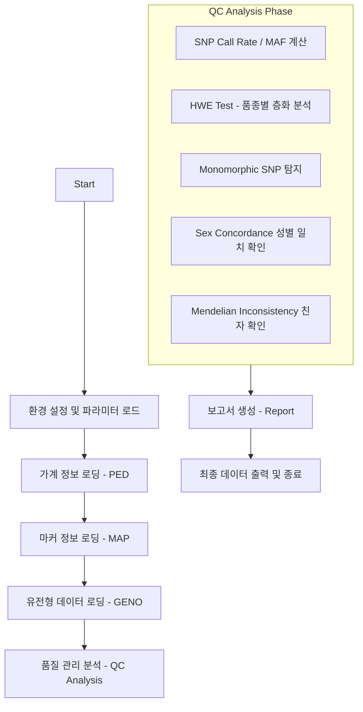

# popQC (Population Quality Control) Pipeline Workflow Guide

## 1. 개요 (Introduction)
`popQC`는 유전체 SNP 데이터를 분석하여 품질 관리를 수행하는 프로그램입니다. `ReadFR` 프로그램에서 생성된 유전체 파일(GENO), 가계 파일(PED), 지도 파일(MAP)을 입력으로 받아 SNP 및 개체 수준의 통계량을 계산하고 필터링을 수행합니다.

## 2. 주요 구성 요소 (Key Components)
- **입력 파일**: 가계 파일(PED), 지도 파일(MAP), 유전형 파일(GENO)
- **주요 모듈**: 
    - `M_ReadPar`: 파라미터 파일 해석
    - `M_ReadFile`: 대용량 유전형 파일 읽기
    - `M_HWEParam`: Hardy-Weinberg Equilibrium(HWE) 계산
    - `M_PEDHashTable`: 개체 정보 관리 (해시 테이블)

## 3. 업무 처리 흐름 (Workflow)

### 3.1 SETUP PHASE (설정 단계)
- 파라미터 파일(`.txt`)을 읽어 분석 대상 파일 경로와 QC 임계값(Threshold)을 설정합니다.
- 각 파일의 필드 위치(Field Location) 및 구분자 정보를 확인합니다.

### 3.2 DATA LOADING PHASE (데이터 로드 단계)
1. **PED 정보**: 동물의 ID, 성별, 품종 정보를 해시 테이블에 저장하여 빠른 조회를 지원합니다.
2. **MAP 정보**: SNP의 염색체 번호와 위치를 로드합니다.
3. **GENO 정보**: 바이너리 또는 텍스트 형태의 유전체 정보를 행렬 형태로 로드합니다.

### 3.3 QC ANALYSIS PHASE (분석 단계)
- **SNP-level QC**:
    - **Call Rate**: 데이터 누락이 많은 SNP 제거.
    - **MAF (Minor Allele Frequency)**: 희귀 대립유전자를 가진 SNP 필터링.
    - **HWE (Hardy-Weinberg Equilibrium)**: 품종별 집단 내 유전적 평형 상태를 검정 (Chi-square, FDR 보정 포함).
- **Animal-level QC**:
    - **Sex Concordance**: X 염색체 SNP의 이형접합성(Heterozygosity)을 분석하여 기록된 성별과 유전적 성별 일치 여부 확인.
    - **Mendelian Inconsistency**: 부모와 자식 간의 유전형 모순이 있는지 검사.

### 3.4 FINALIZATION PHASE (마무리 단계)
- 분석 결과를 텍스트 형태(`popQC_snp_qc_report.txt`)로 저장합니다.
- 필터링을 통과한 깨끗한(Clean) 유전체 데이터를 생성합니다.

---
*Note: This document provides the logic flow for the popQC program v0.1.*
