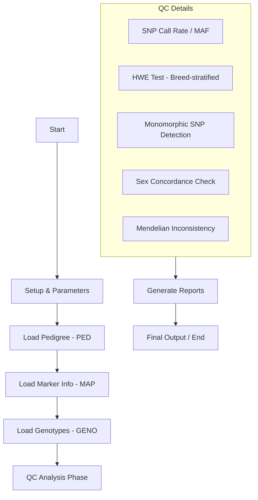

# popQC (Population Quality Control) Pipeline & Algorithm Specification

본 문서는 `popQC` 프로그램의 전체 업무 흐름(Workflow)과 각 단계별 세부 QC 알고리즘을 통합한 기술 사양서입니다.

---

## 1. 개요 (Introduction)
`popQC`는 유전체 SNP 데이터를 분석하여 품질 관리를 수행하는 전문 프로그램입니다. `ReadFR` 프로그램에서 생성된 유전체 파일(GENO), 가계 파일(PED), 지도 파일(MAP)을 입력으로 받아 SNP 및 개체 수준의 통계량을 계산하고 필터링을 수행하여 신뢰성 있는 유전 분석 데이터를 생성합니다.

### 1.1 입력 데이터 (Input Data)
- **가계 파일 (PED)**: 동물 ID, 아버지(Sire), 어머니(Dam), 성별, 품종 정보 등
- **지도 파일 (MAP)**: SNP의 염색체 번호 및 유전적 위치 정보
- **유전형 파일 (GENO)**: 개체별 SNP 유전자형 데이터 (바이너리 또는 텍스트)

---

## 2. 업무 처리 흐름 (Workflow)

---

## 3. 품질 관리 알고리즘 (QC Algorithms)

### 3.1 SNP-level Quality Control

#### 3.1.1 Call Rate (SNP 결측률)
- **목적**: 대다수 개체에서 전형(Genotyping)이 되지 않은 SNP 제거.
- **알고리즘**: $CallRate_j = \frac{N - M_j}{N}$ (여기서 $M_j$는 SNP $j$의 결측 개수)
- **임계값**: `MIN_CALLRATE` (예: 0.90) 미달 시 필터링.

#### 3.1.2 MAF (Minor Allele Frequency, 희귀 대립유전자 빈도)
- **목적**: 통계적 유의성이 낮은 희귀 변이 제거.
- **알고리즘**: $MAF_j = \min(Freq(A1), Freq(A2))$
- **임계값**: `MIN_MAF` (예: 0.01) 미달 시 필터링.

#### 3.1.3 HWE (Hardy-Weinberg Equilibrium, 유전적 평형)
- **목적**: 유전형 전형 오류(Genotyping Error) 검출.
- **세부 기법**: 
    - **품종 층화**: 품종별 p-value 산출 후 통합.
    - **다중 검정 보정**: `Bonferroni` 또는 `FDR (Benjamini-Hochberg)` 적용.

---

### 3.2 Animal-level Quality Control

#### 3.2.1 Sex Concordance (성별 일치 여부 및 통합 검증)
- **목적**: 기록된 성별(PED)과 생물학적 성별(Genotype)의 일치 여부를 확인하여 샘플 혼합이나 기록 오류를 검출.
- **알고리즘 (Sex Inference)**:
    1. **X-Chromosome Heterozygosity ($F_{het}$)**: X 염색체 상의 SNP들에 대해 각 개체의 이형접합성을 계산.
       $F_{het} = \frac{\text{Number of Heterozygous SNPs}}{\text{Total Genotyped SNPs on X}}$
    2. **Sex Prediction Criteria**:
       - **Male (XY)**: $F_{het} < 0.2$ (이론적으로 0에 수렴해야 함)
       - **Female (XX)**: $F_{het} > 0.8$ (상염색체와 유사한 수준)
       - **Suspect/Uncertain**: $0.2 \le F_{het} \le 0.8$ 범위의 개체.
- **통합 QC 및 Parent Seek 반영**:
    - **Suspect Classification**: $F_{het}$ 기준 미달 개체 또는 PED 성별과 불일치하는 개체는 즉시 `SEX_SUSPECT` 플래그를 부여.
    - **Cross-Validation**: `SEX_SUSPECT`로 분류된 개체는 3.2.2절의 **Mendelian Inconsistency** 검사 결과와 통합 분석됨.
    - **Parent Seek 연동**: 
        - 부모 후보군 검색 시, 성별이 불충분하거나 오류인 개체는 부모(Sire/Dam) 역할의 적합성을 재검토.
        - 예: 수컷으로 기록되었으나 유전적 암컷으로 판명된 경우(Sex Mismatch), 기존 Sire 정보를 삭제하고 새 후보군 탐색 시 Dam 후보군으로 재배치하여 `Parent Seek` 알고리즘 수행.
- **검증**: 불일치 및 의심 개체 정보를 최종 리포트에 기록하여 사용자 수동 확인 및 `AUTO_UPDATE` 옵션에 활용.

#### 3.2.2 Mendelian Inconsistency (친자 유전 모순 및 자동 수정)
- **목적**: 가계부(PED) 상의 부모-자손 관계 모순 검출 및 파라미터 옵션에 따른 부모 정보의 자동 수정/제안.
- **알고리즘 (Detection)**: 
    - 부모와 자손 간의 반대 호모 유전자형(Opposite Homozygotes, 예: AA(0) vs BB(2)) 발생 횟수($N_{err}$) 계산.
    - **Inconsistency Rate ($R_{err}$)**: $R_{err} = \frac{N_{err}}{N_{valid\_SNPs}}$
- **자동 수정 알고리즘 (Correction by Parameter Option)**:
    - **입력 모수**: `PARENT_CHECK` (ON/OFF), `PARENT_CORRECT_THRESHOLD` (예: 0.05), `CANDIDATE_POOL` (전체 Sire/Dam 후보군)
    - **수행 로직**:
        1. **모순 확인**: $R_{err} > PARENT\_CORRECT\_THRESHOLD$ 인 경우 해당 부모 정보를 'Supect'으로 분류.
        2. **최적 부모 검색**: 후보군 내의 모든 잠재적 부모와 자손의 유전형을 대조하여 $R_{err}$이 가장 낮은(일반적으로 < 0.01) 개체를 검색.
        3. **옵션 기반 처리**:
            - `REPORT_ONLY`: 수정 후보군 리스트만 보고서에 출력.
            - `AUTO_UPDATE`: 발견된 최적 부모 ID로 가계 데이터 내부 메모리 및 출력 PED 파일을 자동 갱신.
- **조치**: 모순율이 높으나 대안 부모를 찾지 못한 개체는 `unknown(0)` 처리하거나 분석 데이터셋에서 제외.

---

## 4. 최종 출력 및 보고
- **QC Report**: `popQC_snp_qc_report.txt` 등의 파일에 각 단계별 필터링 결과 요약.
- **Clean Data**: 품질 관리를 통과한 정제된 유전형 데이터셋 생성.

---
*Generated by GitHub Copilot - March 2026*
